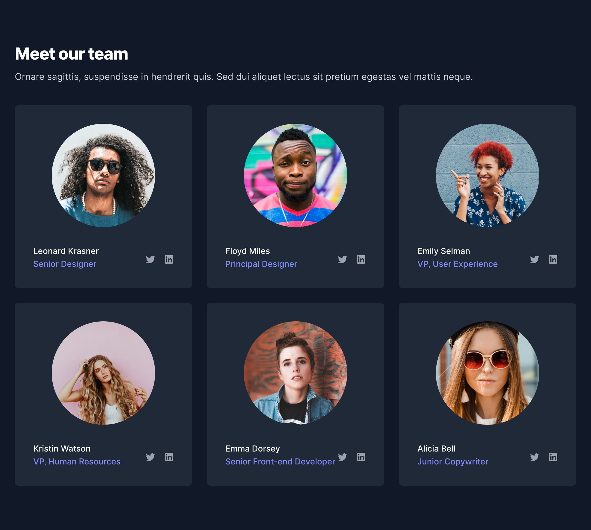

# Full Stack & Front-End Developer Assessment 

The scope of this assessment is to use the following mockup to build a "Meet our team" page using HTML, CSS, and JavaScript.  You will be asked to provide a link to your project prior to your technical or team interview.



### Requirements
* Build a webpage using HTML and CSS
* Make the page layout responsive for mobile, tablet, and desktop:
  * Single column layout up to 480px
  * Two column layout up to 900px
  * Three column layout for screens 901px and up
  * Set a max width on the card layout at 1280px and center the content
* Create hyperlinks and hover states for LinkedIn and Twitter icons


### Specifications

#### Typography
You may use any **sans-serif** system or [Google font](https://fonts.google.com/). 

#### Hex Colors
```
#0e131e // Body
#191f2b // Card Background
#ffffff // Text White (Heading)
#c5cdd8 // Text Light (Name)
#6f71f1 // Text Hightlight (Title)
```
#### Content
```
Heading: Meet our team
Intro: Donec dapibus scelerisque orci, sed consectetur est posuere sed. Duis viverra interdum vulputate

[
    {
        "name":"Leonard Krasner",
        "title":"Senior Designer",
        "twitterUrl":"https://twitter.com/leokras92",
        "linkedInUrl":"https://linkedin.com/in/leokras92",
        "profileImg":"https://res.cloudinary.com/dot-foods/image/upload/v1649374854/sse-3-images/leonard-krasner_k6wogh.png"
    },
    {
        "name":"Floyd Miles",
        "title":"Principal Designer",
        "twitterUrl":"https://twitter.com/fllloydm",
        "linkedInUrl":"https://linkedin.com/in/fllloydm",
        "profileImg":"https://res.cloudinary.com/dot-foods/image/upload/v1649374854/sse-3-images/floyd-miles_d3ad0q.png"
    },
    {
        "name":"Anna Roberts",
        "title":"Partner, Creative",
        "twitterUrl":"https://twitter.com/aroberts94",
        "linkedInUrl":"https://linkedin.com/in/aroberts94",
        "profileImg":"https://res.cloudinary.com/dot-foods/image/upload/v1649374855/sse-3-images/anna-roberts_l2fbkj.png"
    },
    {
        "name":"Whitney Francis",
        "title":"Copywriter",
        "twitterUrl":"https://twitter.com/whitneyfrancis",
        "linkedInUrl":"https://linkedin.com/in/whitneyfrancis",
        "profileImg":"https://res.cloudinary.com/dot-foods/image/upload/v1649374854/sse-3-images/whitney-francis_zywbee.png"
    },
    {
        "name":"Alicia Bell",
        "title":"Junior Copywriter",
        "twitterUrl":"https://twitter.com/bellalicia",
        "linkedInUrl":"https://linkedin.com/in/bellalicia",
        "profileImg":"https://res.cloudinary.com/dot-foods/image/upload/v1649374854/sse-3-images/alicia-bell_dmuyow.png"
    },
    {
        "name":"Emma Dorsey",
        "title":"Senior Front-end Developer",
        "twitterUrl":"https://twitter.com/thedorseyem",
        "linkedInUrl":"https://linkedin.com/in/thedorseyem",
        "profileImg":"https://res.cloudinary.com/dot-foods/image/upload/v1649374855/sse-3-images/emma-dorsey_byn3pp.png"
    }
]


```
#### Images 
All profile images are in the images folder in this respository as well as hosted on Cloudinary CDN. You can use these links for the following profile pictures (names may differ from the mockup).

* leonard-krasner - [https://res.cloudinary.com/dot-foods/image/upload/v1649374854/sse-3-images/leonard-krasner_k6wogh.png](https://res.cloudinary.com/dot-foods/image/upload/v1649374854/sse-3-images/leonard-krasner_k6wogh.png)
* floyd-miles - [https://res.cloudinary.com/dot-foods/image/upload/v1649374854/sse-3-images/floyd-miles_d3ad0q.png](https://res.cloudinary.com/dot-foods/image/upload/v1649374854/sse-3-images/floyd-miles_d3ad0q.png)
* anna-roberts [https://res.cloudinary.com/dot-foods/image/upload/v1649374855/sse-3-images/anna-roberts_l2fbkj.png](https://res.cloudinary.com/dot-foods/image/upload/v1649374855/sse-3-images/anna-roberts_l2fbkj.png)
* whitney-francis - [https://res.cloudinary.com/dot-foods/image/upload/v1649374854/sse-3-images/whitney-francis_zywbee.png](https://res.cloudinary.com/dot-foods/image/upload/v1649374854/sse-3-images/whitney-francis_zywbee.png)
* emma-dorsey - [https://res.cloudinary.com/dot-foods/image/upload/v1649374855/sse-3-images/emma-dorsey_byn3pp.png](https://res.cloudinary.com/dot-foods/image/upload/v1649374855/sse-3-images/emma-dorsey_byn3pp.png)
* alicia-bell - [https://res.cloudinary.com/dot-foods/image/upload/v1649374854/sse-3-images/alicia-bell_dmuyow.png](https://res.cloudinary.com/dot-foods/image/upload/v1649374854/sse-3-images/alicia-bell_dmuyow.png)

* Twitter Icon - [https://res.cloudinary.com/dot-foods/image/upload/v1649377334/sse-3-images/twitter-icon_vrfevs.png](https://res.cloudinary.com/dot-foods/image/upload/v1649377334/sse-3-images/twitter-icon_vrfevs.png)
* LinkedIn Icon - [https://res.cloudinary.com/dot-foods/image/upload/v1649377334/sse-3-images/linkedin-icon_knv4dg.png](https://res.cloudinary.com/dot-foods/image/upload/v1649377334/sse-3-images/linkedin-icon_knv4dg.png)

### JavaScript
Bonus points for using any modern JavaScript framework like [Vue.js](https://vuejs.org/), [React](https://reactjs.org/), [Angular](https://angular.io/), or [AlpineJs](https://alpinejs.dev/), but feel free to use vanila JavaScript ES6 or jQuery if you feel more comfortable.

### CSS
TBD

### You may use
Any web-based developer tool that allows you to share a link to your project like [Codepen](https://codepen.io/) or [CodeSandbox](https://codesandbox.io/).
